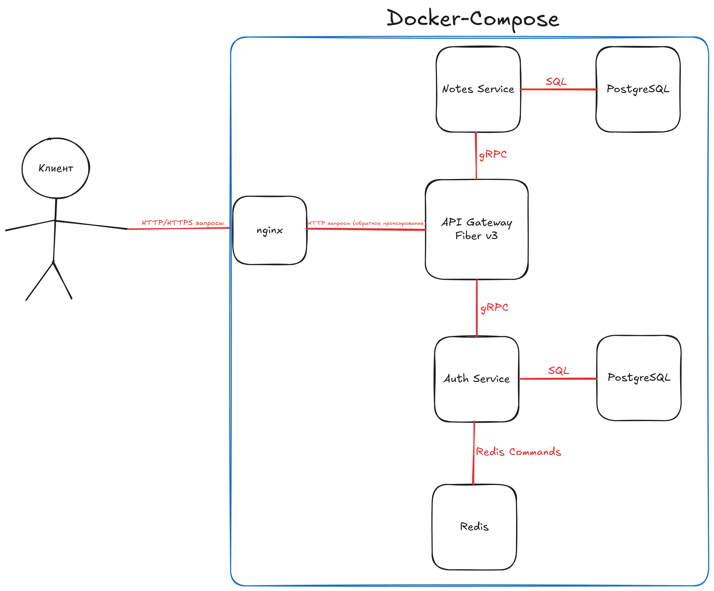

# notes-microservices

Backend для заметок на Go с микросервисной архитектурой.

## Технологии

- Go
- PostgreSQL (раздельно для `auth` и `notes`)
- Redis (кэш)
- Fiber v3 + Nginx
- JWT + bcrypt
- golang-migrate
- Docker Compose

## Быстрый старт

```bash
cp .env.example deploy/.env
cd deploy
docker-compose up -d
```

API будет доступен на `http://localhost:80`.

## Локальный запуск

```bash
# генерация protobuf
task proto:gen:linux

go run ./cmd/auth &
go run ./cmd/notes &
go run ./cmd/gateway
```

## Основные HTTP эндпоинты

### Auth

- `POST /api/v1/auth/register`
- `POST /api/v1/auth/login`
- `POST /api/v1/auth/refresh`
- `POST /api/v1/auth/logout`
- `GET /api/v1/user/profile`

### Notes

- `POST /api/v1/notes`
- `GET /api/v1/notes/{note_id}`
- `GET /api/v1/notes?limit=10&offset=0`
- `PATCH /api/v1/notes/{note_id}`
- `DELETE /api/v1/notes/{note_id}`

```bash
go test ./...
golangci-lint run
```

## Схема

