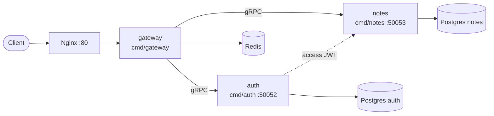

# notes-microservices

> **Training.** Learning exercise in Go microservices (hexagonal layout,
> gRPC, Fiber gateway). **Not** production-hardened: gaps in tests, key
> management, and ops defaults remain.

Module: `github.com/flexer2006/notes-microservices`  
Services: `auth`, `notes`, HTTP `gateway`.

## Stack

- Go
- PostgreSQL (DB per service: auth / notes)
- Redis (gateway cache)
- Fiber v3 + Nginx
- gRPC + protobuf
- JWT HS256 (separate access/refresh secrets) + bcrypt
- golang-migrate
- Docker Compose

## Quick start

From this repository root:

```bash
cp .env.example deploy/.env
docker compose -f deploy/docker-compose.yml up -d --build
```

HTTP API: `http://localhost:80` (Nginx → `gateway`).

## Local run

```bash
task proto:gen   # or: bash scripts/gen_proto.sh

go run ./cmd/auth &
go run ./cmd/notes &
go run ./cmd/gateway
```

Requires local Postgres/Redis (or Compose infra) and env from `.env.example`.

## HTTP API

### Auth

- `POST /api/v1/auth/register`
- `POST /api/v1/auth/login`
- `POST /api/v1/auth/refresh`
- `POST /api/v1/auth/logout`
- `GET /api/v1/user/profile`

### Notes

- `POST /api/v1/notes`
- `GET /api/v1/notes/{note_id}`
- `GET /api/v1/notes?limit=10&offset=0`
- `PATCH /api/v1/notes/{note_id}`
- `PUT /api/v1/notes/{note_id}`
- `DELETE /api/v1/notes/{note_id}`

## Checks

```bash
go test ./...
go vet ./...
golangci-lint run ./...
```

## Layout

Paths relative to this repository root:

```text
cmd/auth|notes|gateway          # process entrypoints
internal/bootstrap              # composition root
internal/app                    # use cases / BFF
internal/ports                  # interfaces
internal/domain                 # entities / errors
internal/adapters/              # grpc, http, postgres, redis, jwt, bcrypt
internal/{config,fault,logger,authctx}
api/**/*.proto  →  gen/         # task proto:gen
migrations/{auth,notes}/
deploy/                         # compose, Dockerfile, nginx
scripts/gen_proto.sh
.env.example
```

## Architecture


```mermaid
flowchart LR
  C([Client]) --> N[Nginx :80]
  N --> G["gateway<br/>cmd/gateway"]

  G -->|gRPC| A["auth<br/>cmd/auth :50052"]
  G -->|gRPC| S["notes<br/>cmd/notes :50053"]
  G --> R[(Redis)]

  A --> PA[(Postgres auth)]
  S --> PN[(Postgres notes)]

  A -.->|access JWT| S
```
